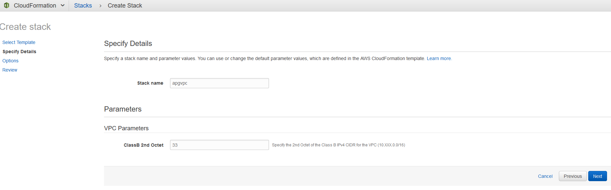
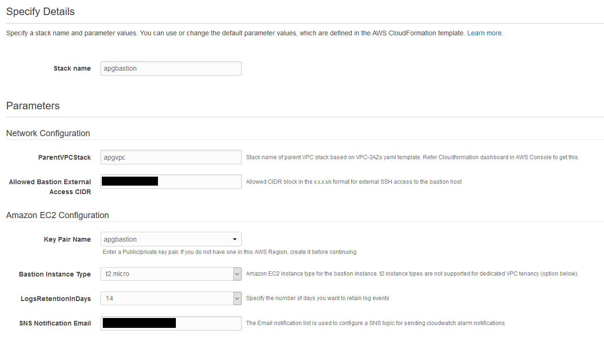
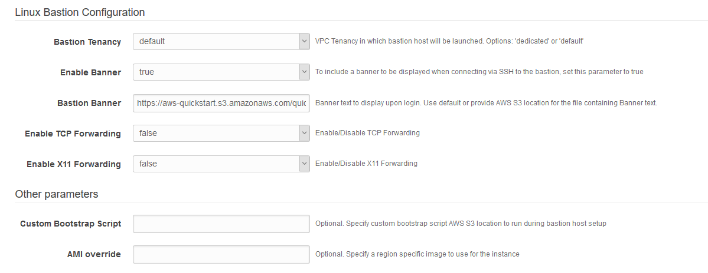
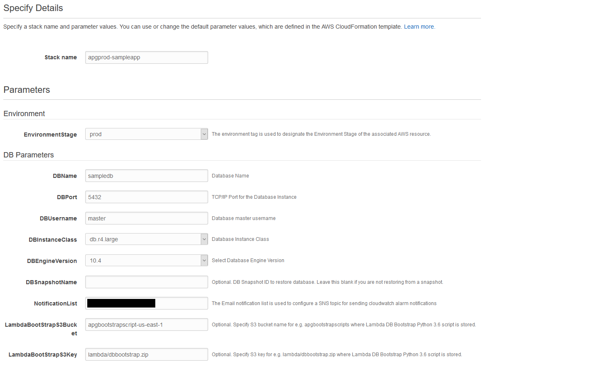
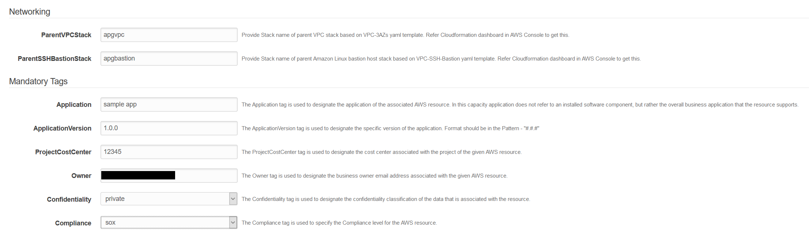
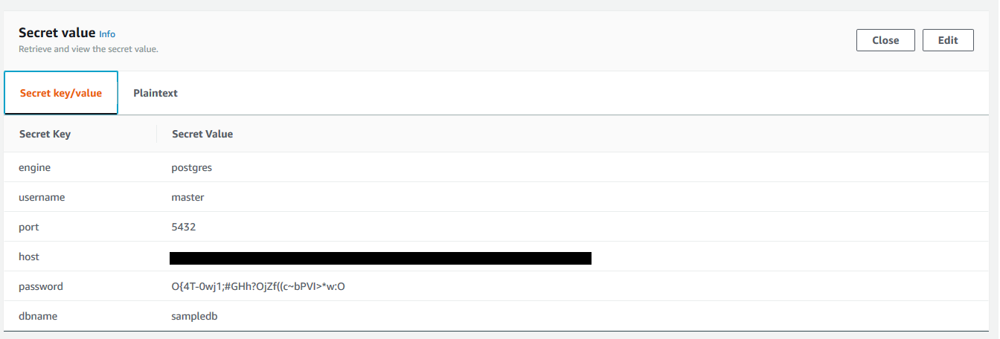

# AWS Aurora CloudFormation Samples

In this document, I will cover how to do a quick start reference
deployment of [Amazon Aurora
PostgreSQL](https://aws.amazon.com/rds/aurora/details/postgresql-details/)
cluster based on AWS best practices for security and high availability
using [AWS CloudFormation](https://aws.amazon.com/cloudformation/). I
will walk through a set of sample CloudFormation templates, which you
can customize to suit your needs.

Amazon Aurora is a MySQL and PostgreSQL compatible [relational
database](https://aws.amazon.com/relational-database/) built for the
cloud that combines the performance and availability of high-end
commercial databases with the simplicity and cost-effectiveness of open
source databases. The PostgreSQL-compatible edition of Aurora delivers
up to 3X the throughput of standard PostgreSQL running on the same
hardware, enabling existing PostgreSQL applications and tools to run
without requiring modification. The combination of PostgreSQL
compatibility with Aurora enterprise database capabilities provides an
ideal target for commercial database migrations. 

When you are starting your journey with Aurora PostgreSQL and want to
setup AWS resources based on recommended best practices of AWS well
architected framework, you can use the CloudFormation templates provided
here. AWS Cloudformation standardizes and automates the provisioning
process of AWS resources, allowing you to build and rebuild your
infrastructure and applications, without having to perform manual
actions or write custom scripts. This helps you to standardize
infrastructure components used across your organization, enabling
configuration compliance and faster troubleshooting.

# Architecture overview

Here is a diagram of our architecture.

Using AWS Cloudformation, you will be setting up a VPC with one public
subnet and one private subnet in each of the three availability zones in
the AWS region you choose. You will be setting up a Linux bastion host
in an Auto Scaling group configuration in public subnets which you will
use to connect to Aurora DB cluster. The Aurora PostgreSQL DB cluster
will be provisioned in the private subnets as per AWS Security best
practice. Monitoring will be configured to send SNS notification using
CloudWatch alarms for key CloudWatch metrics and RDS event notifications
for db-cluster, db-instance and db-parameter-group source types. You
will be using AWS Secrets manager to generate a random master user
credential which will be attached to the Aurora DB Cluster. A Python
based lambda function backed by Cloudformation custom resource will be
configuring automatic credential rotation every 30 days using AWS Secret
manager provided Serverless application repository. The database will be
bootstrapped (more details later) as soon as it’s created using another
Python based lambda function backed by Cloudformation custom resource.
The lambda functions will be deployed in private subnets and they will
use S3 gateway endpoint to communicate with S3 and VPC interface
endpoint to communicate with AWS Secrets manager securely without
requiring internet connectivity.

The sample CloudFormation templates will provision the network
infrastructure and all the components shown in the architecture diagram.
I have broken the CloudFormation templates into the following three
stacks.

1.  CloudFormation template to setup VPC, subnets, route tables,
    internet gateway, NAT gateway, S3 gateway endpoint, AWS Secrets
    Manager interface endpoint and other networking components

2.  CloudFormation template to setup an Amazon Linux Bastion host in an
    Auto Scaling group to connect to the Aurora PostgreSQL DB cluster

3.  CloudFormation template to setup Aurora PostgreSQL DB cluster with
    master user password stored in AWS Secrets Manager and bootstrap the
    database using AWS Lambda

The stacks are integrated using exported output values. Using three
different Cloudformation stacks instead of one nested stack gives you
some flexibility. For example, you can choose to deploy the VPC and
Bastion host CloudFormation stacks once and Aurora PostgreSQL DB Cluster
CloudFormation stack multiple times in an AWS region.

# Best practices

The architecture built by these CloudFormation templates supports AWS
best practices for high availability and security.

The VPC CloudFormation template

1.  Sets up three Availability Zones for high availability and disaster
    recovery. Availability Zones are geographically distributed within a
    region and spaced for best insulation and stability in the event of
    a natural disaster.

2.  Provisions one public subnet and one private subnet for each
    Availability Zone. AWS recommends using public subnets for
    external-facing resources and private subnets for internal
    resources.

3.  Creates and associates [network
    ACLs](https://docs.aws.amazon.com/vpc/latest/userguide/vpc-network-acls.html)
    to the private and public subnets. AWS recommends using network ACLs
    as firewalls to control inbound and outbound traffic at the subnet
    level. These network ACLs provide individual controls that you can
    customize as a second layer of defense.

4.  Creates and associates independent routing table for each of the
    private subnets, which you can configure as per need to control the
    flow of traffic within and outside the Amazon VPC. The public
    subnets share a single routing table, because they all use the same
    Internet gateway as the sole route to communicate with the Internet.

5.  Creates a [NAT
    gateway](https://docs.aws.amazon.com/vpc/latest/userguide/vpc-nat-gateway.html)
    in each of the three public subnets for high availability. NAT
    gateways offer major advantages in terms of deployment,
    availability, and maintenance over NAT instances while allowing
    instances in a private subnet to connect to the internet or other
    AWS services, but prevent the internet from initiating a connection
    with those instances.

6.  Creates an [S3 VPC
    Endpoint](https://docs.aws.amazon.com/vpc/latest/userguide/vpc-endpoints-s3.html)
    which provides resources in private subnets (for e.g. AWS Lambda) to
    communicate with Amazon S3 in a secure and reliable way.

7.  Creates AWS Secrets Manager [interface VPC
    endpoint](https://docs.aws.amazon.com/vpc/latest/userguide/vpce-interface.html)
    which provides lambda resources in private subnets to communicate in
    a secure way with Secrets Manager service without requiring internet
    access.

The Amazon Linux Bastion host CloudFormation template

1.  Creates an [auto scaling
    group](https://docs.aws.amazon.com/autoscaling/ec2/userguide/AutoScalingGroup.html)
    spread across the three public subnets setup by the VPC
    CloudFormation template. The Auto Scaling group ensures that the
    Amazon Linux bastion host is always available in one of the three
    Availability Zones.

2.  Sets up [Elastic IP
    address](https://docs.aws.amazon.com/AWSEC2/latest/UserGuide/elastic-ip-addresses-eip.html)
    and associates with the Amazon Linux Bastion host. Elastic IP
    address makes it easier to remember and allow these IP addresses
    from on-premises firewalls. If an instance is terminated and the
    Auto Scaling group launches a new instance in its place, the
    existing Elastic IP address is re-associated with the new instance.
    This ensures that the same trusted Elastic IP address is used at all
    times.

3.  Sets up an [EC2 security
    group](https://docs.aws.amazon.com/AWSEC2/latest/UserGuide/using-network-security.html)
    and associates with the Amazon Linux Bastion host. This allows
    locking down access to the bastion hosts to known CIDR scopes and
    port for ingress.

4.  Creates an [Amazon CloudWatch
    Logs](https://docs.aws.amazon.com/AmazonCloudWatch/latest/logs/WhatIsCloudWatchLogs.html)
    log group to hold the Amazon Linux bastion host’s shell history logs
    and sets up a CloudWatch metric to keep track of SSH command counts.
    This helps in security audits by allowing you to check when and by
    whom the Bastion host is being accessed.

5.  Creates a CloudWatch Alarm to monitor the CPU on the bastion host
    and send SNS notification when the alarm is triggered.

The Aurora PostgreSQL DB Cluster template

1.  Creates a Multi-AZ Aurora DB Cluster with a Primary instance and an
    Aurora replica in two separate Availability Zones for a prod or
    pre-prod type of Environment. This is recommended by AWS for high
    availability. Aurora automatically fails over to an Aurora Replica
    in case the primary DB instance becomes unavailable.

2.  Places the Aurora DB Cluster in the private subnets as per AWS
    security best practice. To access the DB Cluster you should use the
    Amazon Linux Bastion host, which is setup by the Linux Bastion host
    CloudFormation template.

3.  Sets up an EC2 security group and associates with the Aurora DB
    Cluster. This allows locking down access to the DB Cluster to known
    CIDR scopes and port for ingress.

4.  Generates a random master user password using AWS Secrets manager,
    associates this password with the Aurora DB cluster and configures
    automatic rotation of the password every 30 days using Secrets
    manager provided lambda function. AWS recommends rotating passwords
    regularly to prevent unauthorized access incase the password is
    compromised.

5.  Creates a DB Cluster parameter group with the following setting and
    associates with Aurora DB Cluster.
    
    **Note:** These DB Cluster parameters are provided as a general
    guidance. You should review and customize them to suit your
needs.

    | Parameter                                                                                                                     | Value | Description                                                   |
    | ----------------------------------------------------------------------------------------------------------------------------- | ----- | ------------------------------------------------------------- |
    | [rds.force\_ssl](https://docs.aws.amazon.com/AmazonRDS/latest/UserGuide/CHAP_PostgreSQL.html#PostgreSQL.Concepts.General.SSL) | 1     | This ensures that connections to the Aurora instance use SSL. |

6.  Creates a DB parameter group with the following settings and
    associates with Aurora DB Instances.
    
    **Note:** These DB Instance parameters are provided as a general
    guidance. You should review and customize them to suit your needs.

    <table>
    <thead>
    <tr class="header">
    <th>Parameter</th>
    <th>Value</th>
    <th>Description</th>
    </tr>
    </thead>
    <tbody>
    <tr class="odd">
    <td><a href="https://www.postgresql.org/docs/9.5/static/runtime-config-client.html#GUC-SHARED-PRELOAD-LIBRARIES">shared_preload_libraries</a></td>
    <td>
auto_explain,

    
pg_stat_statements,

    
pg_hint_plan,

    
pgaudit
</td>
    <td><a href="https://www.postgresql.org/docs/9.6/static/auto-explain.html">auto_explain</a> module provides a means for logging execution plans of slow statements automatically, without having to run EXPLAIN by hand. 
    <a href="https://www.postgresql.org/docs/9.6/static/pgstatstatements.html">pg_stat_statements</a> module provides a means for tracking execution statistics of all SQL statements executed by a server. 
    <a href="http://pghintplan.osdn.jp/pg_hint_plan.html">pg_hint_plan</a> gives PostgreSQL ability to manually force some decisions in execution plans. 
    <a href="https://github.com/pgaudit/pgaudit">pgaudit</a> provides detailed session and/or object audit logging via the standard logging facility provided by PostgreSQL.</td>
    </tr>
    <tr class="even">
    <td><a href="https://www.postgresql.org/docs/9.6/static/runtime-config-logging.html#GUC-LOG-STATEMENT">log_statement</a></td>
    <td>"ddl"</td>
    <td>Controls which SQL statements are logged</td>
    </tr>
    <tr class="odd">
    <td><a href="https://www.postgresql.org/docs/9.6/static/runtime-config-logging.html">log_connections</a></td>
    <td>1</td>
    <td>Causes each attempted connection to the server to be logged, as well as successful completion of client authentication.</td>
    </tr>
    <tr class="even">
    <td><a href="https://www.postgresql.org/docs/9.6/static/runtime-config-logging.html">log_disconnections</a></td>
    <td>1</td>
    <td>Causes session terminations to be logged.</td>
    </tr>
    <tr class="odd">
    <td><a href="https://www.postgresql.org/docs/9.6/static/runtime-config-logging.html">log_lock_waits</a></td>
    <td>1</td>
    <td>Controls whether a log message is produced when a session waits longer than deadlock_timeout to acquire a lock.</td>
    </tr>
    <tr class="even">
    <td><a href="https://www.postgresql.org/docs/9.6/static/runtime-config-logging.html#GUC-LOG-MIN-DURATION-STATEMENT">log_min_duration_statement</a></td>
    <td>5000</td>
    <td>Causes the duration of each completed statement to be logged if the statement ran for at least the specified number of milliseconds.</td>
    </tr>
    <tr class="odd">
    <td><a href="https://www.postgresql.org/docs/9.6/static/auto-explain.html">auto_explain.log_min_duration</a></td>
    <td>5000</td>
    <td>Minimum statement execution time, in milliseconds, that will cause the statement's plan to be logged.</td>
    </tr>
    <tr class="even">
    <td><a href="https://www.postgresql.org/docs/9.6/static/auto-explain.html">auto_explain.log_verbose</a></td>
    <td>1</td>
    <td>Controls whether verbose details are printed when an execution plan is logged</td>
    </tr>
    <tr class="odd">
    <td><a href="https://www.postgresql.org/docs/9.6/static/runtime-config-logging.html">log_rotation_age</a></td>
    <td>1440</td>
    <td>When logging_collector is enabled, this parameter determines the maximum lifetime in minutes of an individual log file. After this many minutes have elapsed, a new log file will be created.</td>
    </tr>
    <tr class="even">
    <td><a href="https://www.postgresql.org/docs/9.6/static/runtime-config-logging.html">log_rotation_size</a></td>
    <td>102400</td>
    <td>When logging_collector is enabled, this parameter determines the maximum size in kilobytes of an individual log file. After this many kilobytes have been emitted into a log file, a new log file will be created.</td>
    </tr>
    <tr class="odd">
    <td><a href="https://docs.aws.amazon.com/AmazonRDS/latest/UserGuide/USER_LogAccess.Concepts.PostgreSQL.html">rds.log_retention_period</a></td>
    <td>10080</td>
    <td>Amazon RDS will delete PostgreSQL logs that are older than the specified value in minutes.</td>
    </tr>
    <tr class="even">
    <td><a href="https://www.postgresql.org/docs/9.6/static/runtime-config-query.html">random_page_cost</a></td>
    <td>1</td>
    <td>Makes index scan looks more attractive to the planner compared to table sequential scans</td>
    </tr>
    <tr class="odd">
    <td><a href="https://www.postgresql.org/docs/9.6/static/runtime-config-statistics.html">track_activity_query_size</a></td>
    <td>16384</td>
    <td>Specifies the number of bytes reserved to track the currently executing command for each active session, for the "pg_stat_activity.query" field.</td>
    </tr>
    <tr class="even">
    <td><a href="https://www.postgresql.org/docs/9.6/static/runtime-config-client.html">idle_in_transaction_session_timeout</a></td>
    <td>7200000</td>
    <td>Terminate any session with an open transaction that has been idle for longer than the specified duration in milliseconds.</td>
    </tr>
    <tr class="odd">
    <td><a href="https://www.postgresql.org/docs/9.6/static/runtime-config-client.html">statement_timeout</a></td>
    <td>7200000</td>
    <td>Abort any statement that takes more than the specified number of milliseconds, starting from the time the command arrives at the server from the client.</td>
    </tr>
    <tr class="even">
    <td><a href="https://www.postgresql.org/docs/9.6/static/runtime-config-client.html">search_path</a></td>
    <td>"$user",public'</td>
    <td>This variable specifies the order in which schemas are searched when an object (table, data type, function, etc.) is referenced by a simple name with no schema specified.</td>
    </tr>
    </tbody>
    </table>

7.  Creates a customer managed encryption key using AWS KMS and enables
    Aurora DB Cluster
    [encryption](https://docs.aws.amazon.com/AmazonRDS/latest/AuroraUserGuide/Overview.Encryption.html)
    at rest by using that key.

8.  Configures backup retention to 35 days and 7 days for prod and
    non-prod type of Environment respectively. This is to ensure the
    prod database can be recovered to any point in time in the last 35
    days. Similarly, the non-prod database can be recovered to any point
    in time in the last 7 days.

9.  Automatically enables [Enhanced
    Monitoring](https://docs.aws.amazon.com/AmazonRDS/latest/AuroraUserGuide/USER_Monitoring.OS.html)
    for prod type of Environment with one-second granularity so that you
    can view real time OS metrics and troubleshoot database performance
    issues.

10. Automatically enables [Performance
    Insight](https://aws.amazon.com/rds/performance-insights/),
    configures performance insight data encryption using customer
    manager AWS KMS encryption key and sets performance insight data
    retention to 2 years and 7 days for prod and non-prod type of
    environments respectively. Performance insight helps to quickly
    detect database performance problems and determine when and where to
    take action.

11. Enables [IAM Database
    Authentication](https://docs.aws.amazon.com/AmazonRDS/latest/UserGuide/UsingWithRDS.IAMDBAuth.html)
    to use authentication token instead of database password for
    database login using AWS Identity and Access Management (IAM). When
    you use IAM database authentication, network traffic to and from the
    database is encrypted using Secure Sockets Layer (SSL).

12. Disables Auto Minor Version upgrade option for prod type of
    Environment, so that you can perform the upgrade according to your
    schedule when all non-prod environments are upgraded and you have
    successfully tested application functionality.

13. Configures CloudWatch alarms for key [CloudWatch
    metrics](https://docs.aws.amazon.com/AmazonRDS/latest/AuroraUserGuide/Aurora.Monitoring.html)
    like CPUUtilization, MaximumUsedTransactionIDs and FreeLocalStorage
    for the Aurora database instances and sends SNS notification when
    the alarm is triggered.

14. Configures RDS event notifications for db-cluster, db-instance and
    db-parameter-group source types to notify you when an important
    event is generated.

15. Bootstraps the Aurora DB Cluster upon creation using a Lambda
    function, which creates pg\_stat\_statements (for tracking execution
    statistics of all SQL statements executed by the server) and pgaudit
    (which provides session and/or object level auditing capabilities)
    extensions.

# Prerequisites

Before setting up the Cloudformation stacks, you need to do the
following:

1.  Create an [EC2 key
    pair](https://docs.aws.amazon.com/AWSEC2/latest/UserGuide/ec2-key-pairs.html#having-ec2-create-your-key-pair)
    using Amazon EC2 console in the AWS Region where you are planning to
    setup the CloudFormation stacks. Make sure to save the private key,
    as this the only time you can do this. You will be using this EC2
    key pair as an input parameter while setting up the Amazon Linux
    Bastion host Cloudformation stack.

2.  Create an Amazon S3 bucket and upload the sample database bootstrap
    AWS Lambda zip file, as follows.
    
    1.  Create an S3 bucket in the same AWS Region, where you planning
        to setup the Aurora PostgreSQL DB cluster. No additional
        settings are required within the bucket configuration.
    
    2.  In the bucket, create a folder (prefix).
    
    3.  Download the sample AWS Lambda zip file **dbbootstrap.zip** from
        [GitHub](https://github.com/aws-samples/aws-aurora-cloudformation-samples/tree/master/lambda).
    
    4.  Upload the zip file to the S3 bucket folder.
        
        You will be using the S3 bucket name along with the S3 key
        prefix as input parameters while setting up the Aurora DB
        Cluster CloudFormation Stack. This Zip file will be used to
        create a Lambda function written in Python 2.7, which uses
        PyGreSQL module to connect to the Aurora PostgreSQL cluster and
        bootstrap it upon creation.

# Setting up the Resources using AWS CloudFormation

**Note:** These CloudFormation templates are provided as a general
guidance. You should review and customize them to suit your needs. Some
of the resources deployed by these stacks will incur costs as long as
they are in use.

## Setup VPC, Subnets and other networking components

1.  Choose Launch Stack. This button automatically launches the AWS
    CloudFormation service in your AWS account with a template to
    launch. You are prompted to sign-in if needed. You can view the
    CloudFormation template from within the console if required.

2.  Choose the AWS Region where you want to create the stack on top
    right of the screen and then click **Next**.

3.  The CloudFormation stack requires a few parameters, as shown in the
    following screenshot.

    <!-- end list -->

    - **Stack name** : Enter a meaningful name for the stack, for e.g. apgvpc

    - **ClassB 2nd Octet** : Specify the 2nd Octet of the Class B IPv4 CIDR
    (10.XXX.0.0/16) for the VPC for e.g. 13
    
    

    <!-- end list -->

4.  After entering all the parameter values, click **Next**.

5.  On the next screen, enter any required tags, an
    [IAM](https://aws.amazon.com/iam/) role, or any advanced options,
    and then choose **Next**.

6.  Review the details on the final screen, and then choose **Create**
    to start building the networking resources.

It will take about four minutes to create the stack. Check the AWS
CloudFormation Resources section to see the Physical IDs of the various
components setup by this stack.

Now let’s setup the Amazon Linux Bastion host, which you will use to
login to the Aurora PostgreSQL DB Cluster.

## Setup Amazon Linux Bastion Host

1.  Choose Launch Stack. This button automatically launches the AWS
    CloudFormation service in your AWS account with a template to
    launch.

2.  Choose the AWS Region where you want to create the stack on top
    right of the screen and then click **Next**.

3.  The CloudFormation stack requires a few parameters, as shown in the
    following screenshots.

    <!-- end list -->

    - **Stack name** : Enter a meaningful name for the stack, for e.g.
      apgbastion
    
    - **ParentVPCStack** : Enter the CloudFormation stack name for the VPC
      stack that was setup in the previous step. Refer Cloudformation
      dashboard in AWS Console to get this for e.g. apgvpc
    
    - **Allowed Bastion External Access CIDR** : Enter allowed CIDR block in
      the x.x.x.x/x format for external SSH access to the bastion host
    
    - **Key Pair Name** : Select the key pair name that was setup in the
      prerequisite section.
    
    - **Bastion Instance Type** : Select Amazon EC2 instance type for the
      bastion instance
    
    - **LogsRetentionInDays** : Specify the number of days you want to retain
      CloudWatch log events for the bastion host
    
    - **SNS Notification Email** : Enter the Email notification list which
      will be used to configure a SNS topic for sending CloudWatch alarm
      notifications
    
    - **Bastion Tenancy** : Select the VPC Tenancy in which the bastion host
      will be launched
    
    - **Enable Banner** : Select if you want a banner to be displayed when
      connecting via SSH to the bastion
    
    - **Bastion Banner** : Use Default or provide AWS S3 location for the file
      containing Banner text to be displayed upon login
    
    - **Enable TCP Forwarding** : Select if you want to Enable/Disable TCP
      Forwarding
    
    - **Enable X11 Forwarding** : Select if you want to Enable/Disable X11
      Forwarding
    
    - **Custom Bootstrap Script** : Optional. Specify custom bootstrap script
      AWS S3 location to run during bastion host setup
    
    - **AMI override** : Optional. Specify a region specific image to use for
      the instance
    
    
    
    

    <!-- end list -->

4.  After entering all the parameter values, click **Next**.

5.  On the next screen, enter any required tags, an
    [IAM](https://aws.amazon.com/iam/) role, or any advanced options,
    and then choose **Next**.

6.  Review the details on the final screen, **Check** the box for “**I
    acknowledge that AWS CloudFormation might create IAM resources**”
    and then choose **Create** to start building the networking
    resources.

It will take about five minutes to create the stack. Check the AWS
CloudFormation Resources section to see the Physical IDs of the various
components setup by this stack.

You are now ready to setup the Aurora PostgreSQL DB Cluster.

## Setup Aurora PostgreSQL DB Cluster

1.  Choose Launch Stack. This button automatically launches the AWS
    CloudFormation service in your AWS account with a template to
    launch.

2.  Choose the AWS Region where you want to create the stack on top
    right of the screen and then click **Next**.

3.  The CloudFormation stack requires a few parameters, as shown in the
    following screenshots.

    <!-- end list -->

    - **Stack name** : Enter a meaningful name for the stack, for e.g.
      apgprod-sampleapp
    
    - **EnvironmentStage** : Select the Environment Stage (dev, test,
      pre-prod, prod) of the Aurora PostgreSQL DB Cluster. If you specify,
      “prod” option for this parameter DB backup retention is set to 35
      days, Enhanced Monitoring is turned on with one-second granularity
      and Auto Minor Version upgrade is disabled. If you specify either
      “prod” or “pre-prod” option for this parameter, a Multi-AZ Aurora
      DB Cluster with a Primary instance and an Aurora replica in two
      separate Availability Zones is created.
    
    - **DBName** : Enter Database Name for e.g. sampled
    
    - **DBPort** : Enter TCP/IP Port for the Database Instance
    
    - **DBUsername** : Enter Database master username for e.g. master
    
    - **DBInstanceClass** : Select Database Instance Class
    
    - **DBEngineVersion** : Select Database Engine Version
    
    - **DBSnapshotName** : Optional. Enter the DB Snapshot ID to restore.
      Leave this blank if you are not restoring from a snapshot.
    
    - **NotificationList** : Enter the Email notification list which will be
      used to configure a SNS topic for sending CloudWatch alarm
      notifications
    
    - **LambdaBootStrapS3Bucket** : Specify the S3 bucket name that was
      created in the prerequisite section for e.g.
      *apgbootstrapscript-us-east-1*
    
    - **LambdaBootStrapS3Key** : Specify the S3 Key (containing the folder
      that was created in the prerequisite section and the zip folder
      name) where the Database bootstrap script is stored for e.g.
      *lambda/dbbootstrap.zip*
    
    - **ParentVPCStack** : Provide Stack name of parent VPC stack. Refer
      Cloudformation dashboard in AWS Console to get this.
    
    - **ParentSSHBastionStack** : Provide Stack name of parent Amazon Linux
      bastion host stack. Refer Cloudformation dashboard in AWS Console to
      get this.
    
    - **Application** : The Application tag is used to designate the
      application of the associated AWS resource. In this capacity,
      application does not refer to an installed software component, but
      rather the overall business application that the resource supports.
    
    - **ApplicationVersion** : The ApplicationVersion tag is used to designate
      the specific version of the application.
    
    - **ProjectCostCenter** : The ProjectCostCenter tag is used to designate
      the cost center associated with the project of the given AWS
      resource.
    
    - **Owner** : The Owner tag is used to designate the business owner email
      address associated with the given AWS resource.
    
    - **Confidentiality** : The Confidentiality tag is used to designate the
      confidentiality classification of the data that is associated with
      the resource.
    
    - **Compliance** : The Compliance tag is used to specify the Compliance
      level for the AWS resource.

    

    
	
	<!-- end list -->

4.  After entering the all the parameter values, click **Next**.

5.  On the next screen, enter any required tags, an
    [IAM](https://aws.amazon.com/iam/) role, or any advanced options,
    and then choose **Next**.

6.  Review the details on the final screen, **Check** the box for “**I
    acknowledge that AWS CloudFormation might create IAM resources**”
    and then choose **Create** to start building the networking
    resources.

It will take about twenty five minutes to create the stack. Check the
AWS CloudFormation Resources section to see the Physical IDs of the
various components setup by this stack.

Now, let’s login to the Aurora PostgreSQL DB Cluster and run some basic
commands.

# Login to Aurora DB Cluster using the Amazon Linux Bastion Host

1.  Move the private key of the EC2 key pair (that you had saved in the
    prerequisite section) to a location on your SSH Client, from where
    you will be connecting to the Amazon Linux Bastion Host.

2.  Change the permission of the private key using the following
    command, so that it’s not publicly viewable.

    **chmod 400 \<private key file name for e.g. apgbastion.pem\>**

3.  Go to Cloudformation Dashboard in AWS Console and select the Amazon
    Linux Bastion Host Stack. Select the **Outputs** tab and note down
    the SSHCommand parameter value, which you will use to SSH to the
    Amazon Linux bastion host.

4.  On the SSH client, change directory to the location where you have
    saved the EC2 private key and then copy/paste the SSHCommand Value
    to SSH to the Amazon Linux bastion host.

5.  Go to AWS Secrets manager Dashboard in AWS console. Select the
    secret name from the list of secrets as per your Aurora PostgreSQL
    DB Cluster Cloudformation stack name. Scroll down the page and
    Select **Retrieve secret value**. Note down the password under
    **Secret key/value**, which you will use to login to the Aurora
    PostgreSQL database.
    
    

6.  On the Cloudformation Dashboard, select the Aurora DB Cluster Stack.
    Select **Outputs** tab and note down the PSQLCommandLine parameter
    value, which you will use to login to the Aurora PostgreSQL database
    using [psql
    client](https://www.postgresql.org/docs/9.6/app-psql.html).

7.  PostgreSQL binaries were already setup on the Amazon Linux Bastion
    host by Auto Scaling Launch Configuration. Copy/paste the
    PSQLCommandLine value at the command prompt of the bastion host.

    **psql --host=ClusterEndpoint --port=Port --username=DBUsername --dbname=DBName**

    When prompted, enter the master user password that you copied in step 5 above.

8.  Run some basic commands as shown below.

    

# Summary

I hope you find the CloudFormation templates for setting up your
well-architected Amazon Aurora PostgreSQL DB Cluster infrastructure
helpful and encourage you to modify them to support your business’
needs.

You might consider modifying the Python database bootstrap script (which
is used to create the AWS Lambda function) to include all the standard
SQL statements that you typically run after setting up an Aurora
PostgreSQL DB Cluster.

Before using the Aurora DB Cluster to setup your application related
database objects, you should also consider creating an application
schema, a user that will have full access to create and modify objects
in the application schema, a user that will have read-write access to
the application schema and a user that will have read-only access to the
application schema. You should use the master user that was setup with
the Aurora DB Cluster to administer the DB cluster only. The user having
full access to the application schema should be used to create and
modify application related database objects. Application should use the
read-write user for storing, updating, deleting and retrieving data. Any
reporting kind of application should use the read-only user. This is as
per database security best practice to grant the minimum DB privileges
required to perform required database operations.

As per AWS security best practices, you should also review [AWS
CloudTrail](https://aws.amazon.com/cloudtrail/), [AWS
Config](https://aws.amazon.com/config/) and [Amazon
GuardDuty](https://aws.amazon.com/guardduty/) services and configure
them for your AWS Account. Together these services help you monitor
various activity in your AWS Account; assess, audit, and evaluate the
configurations of your AWS resources; monitor malicious or unauthorized
behavior and detect security threats against your AWS resources.

# License

This library is licensed under the Apache 2.0 License. 
