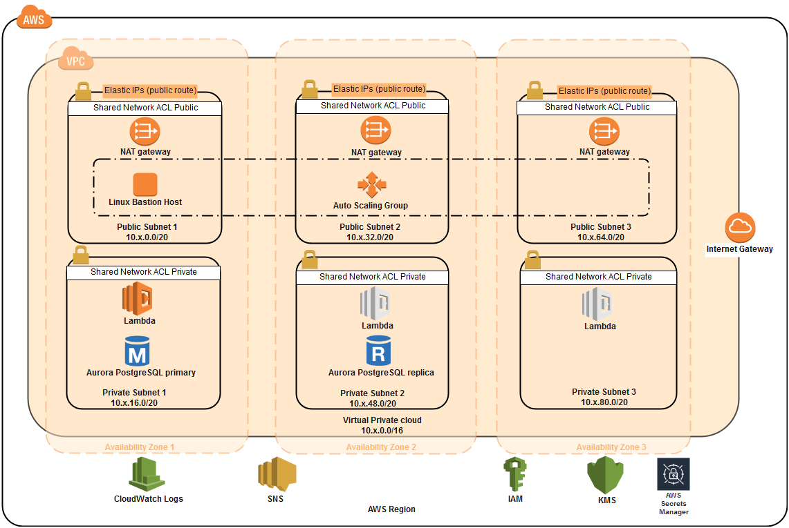

# AWS Aurora CloudFormation Samples

This GitHub repository contains:

1. A set of AWS CloudFormation samples to deploy an Amazon Aurora DB cluster based on AWS security and high availability best practices.
2. Python based source code to bootstrap the database upon creation using AWS Lambda.

When you are starting your journey with Amazon Aurora and want to set up AWS resources based on the recommended best practices of [AWS Well-Architected Framework](https://docs.aws.amazon.com/wellarchitected/latest/userguide/intro.html#waf), you can use the CloudFormation templates provided here. 

# Deploy an Amazon Aurora PostgreSQL DB Cluster

## Architecture overview

Here is a diagram of our architecture and a brief summary of what you are going to set up.

The sample CloudFormation templates provision the network infrastructure and all the components shown in the architecture diagram. I broke the CloudFormation templates into the following three stacks.

1.	CloudFormation template to set up VPC, subnets, route tables, internet gateway, NAT gateway, S3 gateway endpoint, [AWS Secrets Manager](https://aws.amazon.com/secrets-manager/) interface endpoint, and other networking components.
2.	CloudFormation template to set up an Amazon Linux bastion host in an Auto Scaling group to connect to the Aurora PostgreSQL DB cluster.
3.	CloudFormation template to set up Aurora PostgreSQL DB cluster with master user password stored in AWS Secrets Manager and bootstrap the database using [AWS Lambda](http://aws.amazon.com/lambda).

The stacks are integrated using exported output values. Using three different CloudFormation stacks instead of one nested stack gives you some flexibility. For example, you can choose to deploy the VPC and bastion host CloudFormation stacks once and Aurora PostgreSQL DB cluster CloudFormation stack multiple times in an AWS Region.

## Best practices, Prerequisites and Set up Instructions

For Best practices incorporated in the sample AWS CloudFormation samples, prerequisites and set up instructions refer the following document. You can download this document and then launch AWS CloudFormation directly from it, by selecting the  buttons embedded in the set up section.

[Deploy an Amazon Aurora PostgreSQL DB cluster with recommended best practices using AWS CloudFormation](Instructions/Deploy%20an%20Amazon%20Aurora%20PostgreSQL%20DB%20cluster%20with%20recommended%20best%20practices%20using%20AWS%20CloudFormation.pdf)

# License

This library is licensed under the Apache 2.0 License. 
